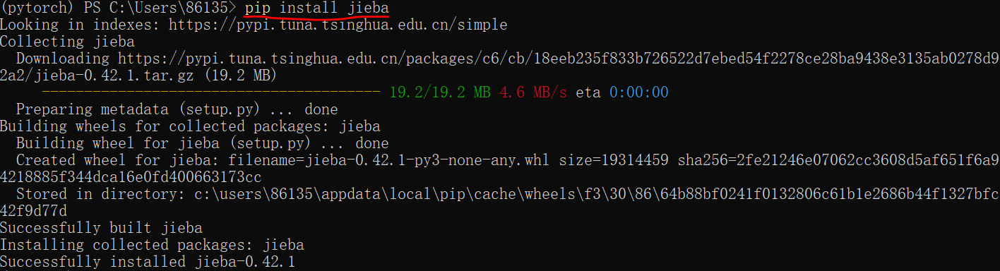

#### 图像分类
- step1. 按照指定格式构造训练和测试数据集

- step2. 图像变换与数据加载
- step3. 定义网络模型
- step4. 定义损失函数和优化器
- step5. 训练
- step6. 保存和加载模型
- step7. 测试

#### 文本分类
- step1 必要库安装 (以jieba为例)

- step2. 数据准备，例如/data/train.csv
- step3. 定义数据字段并加载数据集
- step4. 定义神经网络模型
- step5. 训练
- step6. 保存和加载模型
- step7. 测试

